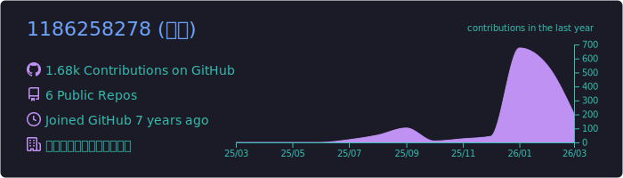
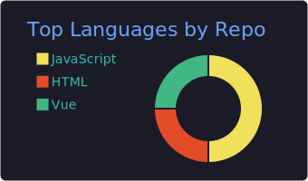
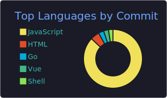
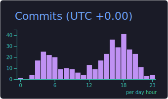

<!-- 顶部渐变装饰 + 标题 -->

<!-- 社交徽章 -->

---

## 👋 Hi, I'm 晴天

> 🏢 **晴辰天下网络科技有限公司** · 📍 中国

💻 热爱开源的全栈开发者，专注于将优秀的开源工具带给中文社区。

- 🦞 维护 [OpenClaw 汉化版](https://github.com/1186258278/OpenClawChineseTranslation)，**848+ Stars**，每小时自动同步
- 🚀 维护 [OpenCode 汉化发行版](https://github.com/1186258278/OpenCodeChineseTranslation)，**214+ Stars**，全自动构建三端安装包
- 📧 开发 [QingChenMail](https://github.com/1186258278/QingChenMail) 企业级自建邮件营销解决方案
- 🔍 开发 [TalentLens](https://github.com/1186258278/TalentLens) AI 驱动的智能简历筛选工具

---

## 🛠️ 技术栈

**Languages**

**Tools & Platforms**

---

## 📊 GitHub 统计

<!-- 由 GitHub Actions 自动生成，存储在仓库中，100% 可靠 -->

---

## 🐍 贡献图动画

<picture>
  <source media="(prefers-color-scheme: dark)" srcset="https://raw.githubusercontent.com/1186258278/1186258278/output/github-snake-dark.svg" />
  <source media="(prefers-color-scheme: light)" srcset="https://raw.githubusercontent.com/1186258278/1186258278/output/github-snake.svg" />
  
</picture>

---

## 📈 贡献活动图

---

<!-- 访客计数 -->

  

**如果我的项目对你有帮助，欢迎 ⭐ Star 支持！**

<!-- 底部渐变装饰 -->

